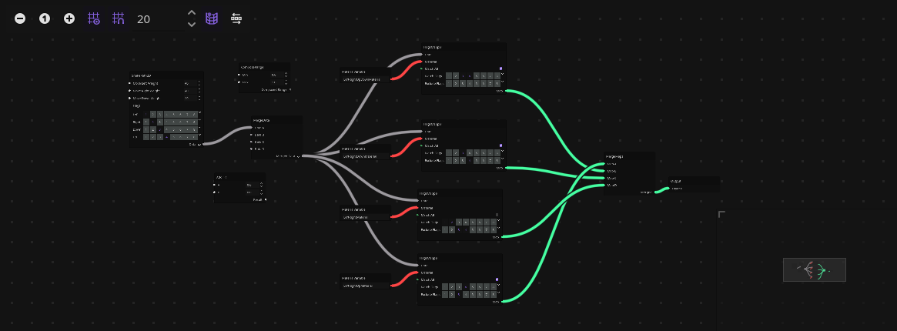
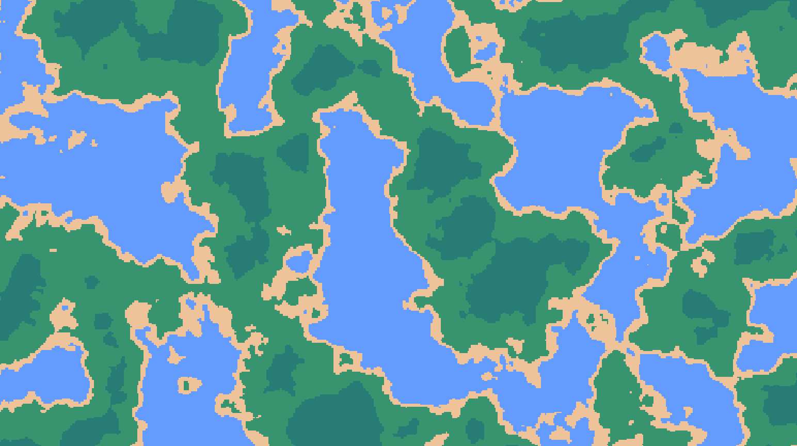

# 🌍 Gaea

  
> Join the **Gamedev Graveyard** discord server to get notified about Gaea and hang out with other devs.

Gaea is an **add-on for Godot 4.4**\*, designed to empower your project with advanced **procedural generation** capabilities.

*For 4.3, use v1.X . For 4.2, use v1.1.3 or lower. For 4.0-4.1, use v0.6.2 or lower.

> **NOTE:** Gaea 2.0 is currently in early development, and may not yet be optimized for larger, more complex projects. Stay tuned for ongoing improvements and enhancements!

### What's in a Name?

**Gaea**, in Greek mythology, is the personification of Earth - a nod towards the terrain and world generation capabilities this addon brings to your game development toolkit. Plus, we think it sounds pretty cool.

# 💫 The Idea

Gaea uses a graph system to create a flow of customizable nodes for endless posibilities in generation, both 2D and 3D. Creating custom nodes is easy, too, so you aren't limited by what the addon has.

Gaea can generate terrains such as:

# Videos
> Note: These are currently outdated and showcase the 1.X version of Gaea.

# 🔧 Installation Steps

1. **Download the project files.**
2. Move the `gaea` folder into your `/addons` folder within your Godot project.
3. Enable the addon through the project settings, and let your world-building journey begin!
