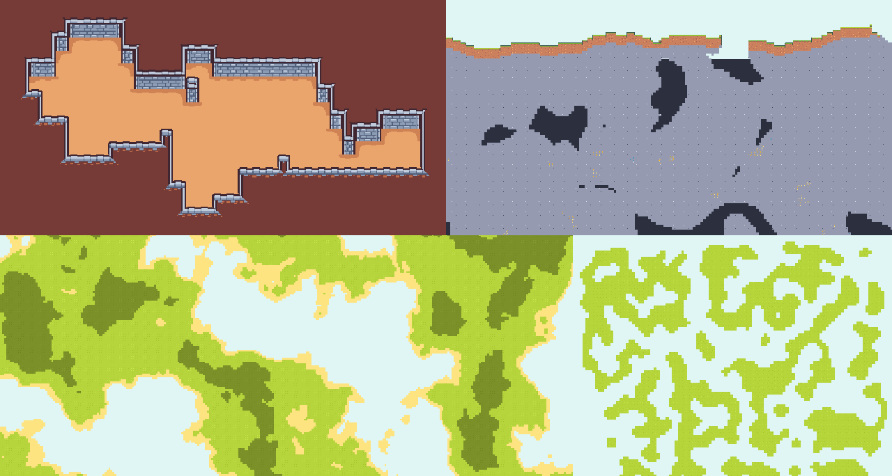

# Generators

**Procedural generation** is a method used in game development and digital media to create vast amounts of content **algorithmically**, rather than manually. A key component of this process is what's known as a **generator**.

A **generator**, in the realm of procedural generation, is essentially an algorithm or set of rules designed to produce content. This content can range from terrain and environments, to structures, objects, textures, sound, and even entire levels or worlds. The primary goal of generators is to automate the creation of diverse and complex content, thereby saving significant time and resources that would otherwise be required to design these elements manually.

Each generator operates based on its unique algorithm, producing different kinds of results. Some might be designed to create natural-looking landscapes, while others might generate intricate dungeon layouts, cityscapes, or other structures.

The use of generators allows for significant **variability** and **replayability** in games. Since the content is created algorithmically, each playthrough can offer an unique experience, with different environments and scenarios generated each time. This leads to an increased sense of exploration and discovery for the player, as they navigate through unique, algorithmically generated worlds.

In an addon that offers various types of generators, each generator serves as a unique tool in the developer's toolbox, providing them with a wide array of procedural generation techniques. This allows developers to pick and choose the most suitable tools for their specific needs, or even to combine different generators for more varied and complex results.
