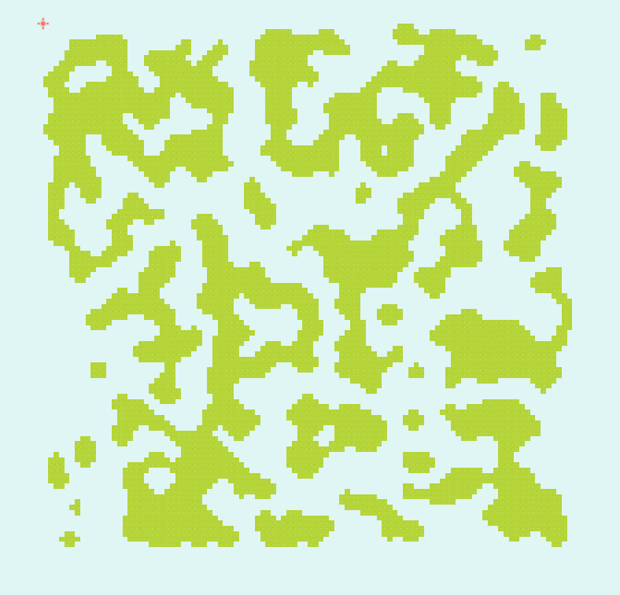

# Cellular Generator

The **Cellular Generator** leverages the principles of Cellular Automata to produce intricate terrain formations. It begins by constructing a stochastic noise grid, serving as a basic terrain layout. In subsequent iterations, the generator applies cellular automata rules, promoting a smoother, more naturally varied landscape. This method excels at creating **organic** and **complex** terrain patterns, enhancing the realism and diversity of in-game environments.

