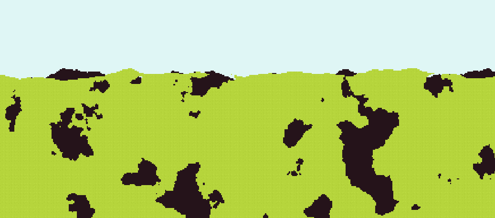
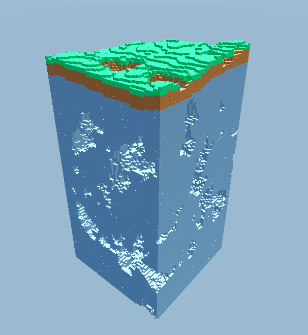

# Heightmap Generator

The **Heightmap Generator** employs noise algorithms to create detailed, two-dimensional terrain. Starting with a grid, each point is assigned a value based on a noise function, effectively determining its 'height', hence forming a landscape. Drawing inspiration from games like [Terraria](https://terraria.org/) or [Minecraft](https://www.minecraft.net/en-us), this generator excels at crafting diverse **terrains** with a realistic feel, ranging from gently rolling hills to towering mountain ranges.

#### HeightmapGenerator2D

#### HeightmapGenerator3D
