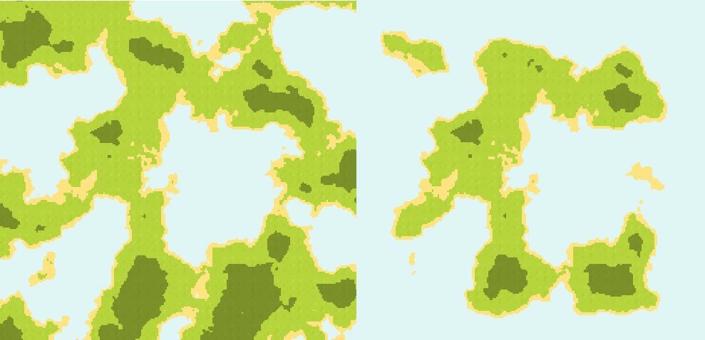

# Noise Generator

The **Noise Generator** uses noise algorithms to generate natural-looking two-dimensional terrain. For each coordinate of the world size, and only if the noise's value at those coordinates is higher than a predetermined threshold, it places a tile. Using different noise algorithms, and changing the noise's parameters, you can generate a wide assortment of terrains.

## How does it work?

NoiseGenerator uses the widely used and very useful **noise texture**: with the different algorithms Godot gives you access to using FastNoiseLite, in addition to a lot of configuration, you can create different terrain shapes and make your very own type of terrain.

Additionally, Gaea's NoiseGenerator comes with a **Falloff Map**, taken from Sebastian Lague's [procedural landmass generation course](https://www.youtube.com/watch?v=COmtTyLCd6I). This texture has higher values at its center which get lower as they get farther away from it. This then gets multiplied with the noise's value, creating an island shape.

> To the left, a terrain that seemingly continues outside the bounds of the screen. To the right, an island surrounded by water. Both terrains use the same seed, but the second one uses the falloff map.