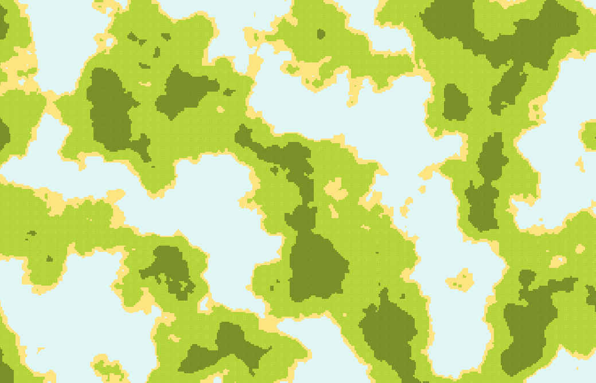

# Noise Generator

The **Noise Generator** uses noise algorithms to generate natural-looking two-dimensional terrain. For each coordinate of the world size, and only if the noise's value at those coordinates is higher than a predetermined threshold, it places a tile. Using different noise algorithms, and changing the noise's parameters, you can generate a wide assortment of terrains.

## How to use it

todo
