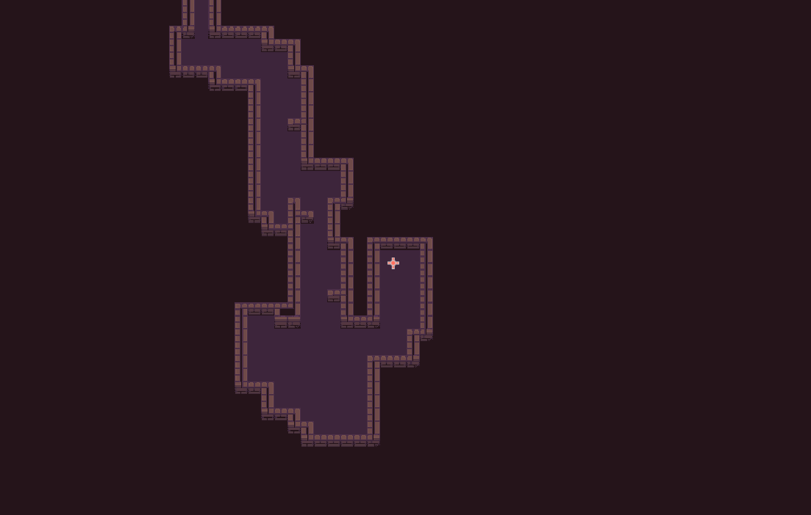

# Walker Generator

The **Walker Generator** utilizes the principle of random walks to create intricate **dungeon** or **cave** formations. This method involves deploying virtual 'walkers', which move in random directions across a grid and place tiles in their wake. This process results in a naturally irregular and winding network of paths, akin to cavern systems or labyrinthine dungeons. It is a technique inspired by games such as [Nuclear Throne](https://store.steampowered.com/app/242680/Nuclear_Throne/), where it contributes to the creation of dynamic and unpredictable gameplay environments.

## Tutorials

- [Getting Started](/tutorials/getting_started.md)