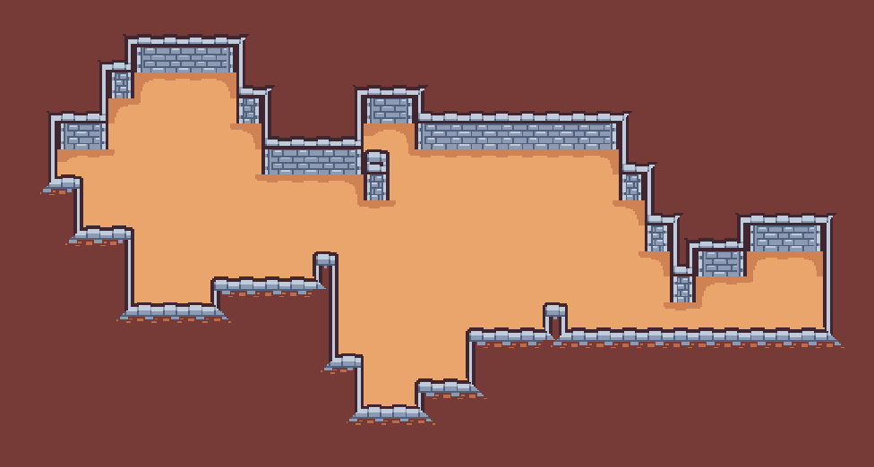
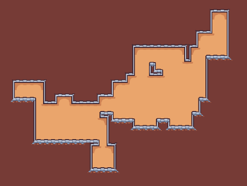

# Modifiers

**Modifiers** are similar to those in software like Blender. You add these to your GeneratorSettings, and they get applied after the generation is finished, giving you varied results and possibilities. 

> **NOTE**: In Gaea, the modifiers' array order matters. Modifiers get applied in this order, so different sequences can give different results.

There are a few modifiers in Gaea at the moment:

### Generate Borders

Generate border tiles around already placed tiles.

### Fill 

Fills the full rectangle of tiles.

*Using Fill to generate autotiled walls around a WalkerGenerator's generation.*

### Carver

Carves holes into the map using a noise texture.

### Smooth

Smoothes the map using Cellular Automata.

### Walls

Adds tiles to those below already placed tiles that aren't the Generator's default tile.

In this example, the walls are added after both the floor and ceiling *(using the Fill modifier)* are added, giving the dungeon a different perspective. 
An example without the Walls modifier looks like this:

### Noise Painter

Replaces tiles in the map with another tile based on a noise texture and a threshold.

### Heightmap Painter

Replaces tiles in the map with another tile based on a noise heightmap.

### Remove Disconnected

Uses flood fill to remove all tiles that aren't connected to `starting_tile`.

_**TODO**: Better explanations._