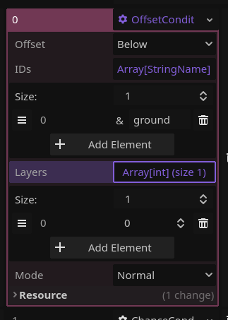
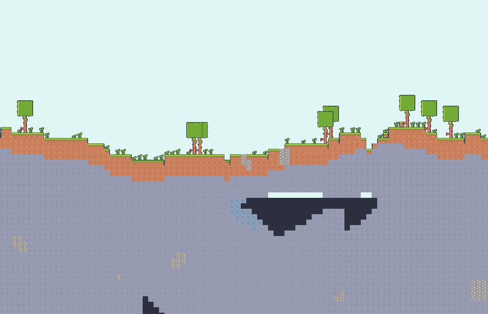
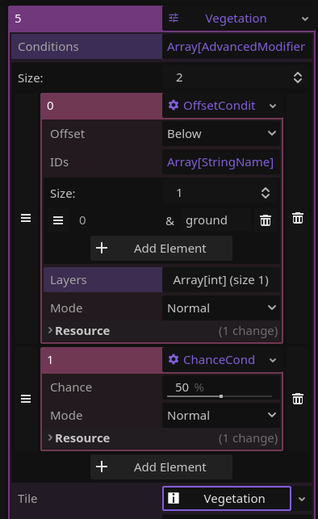
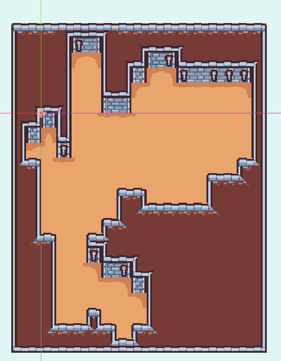
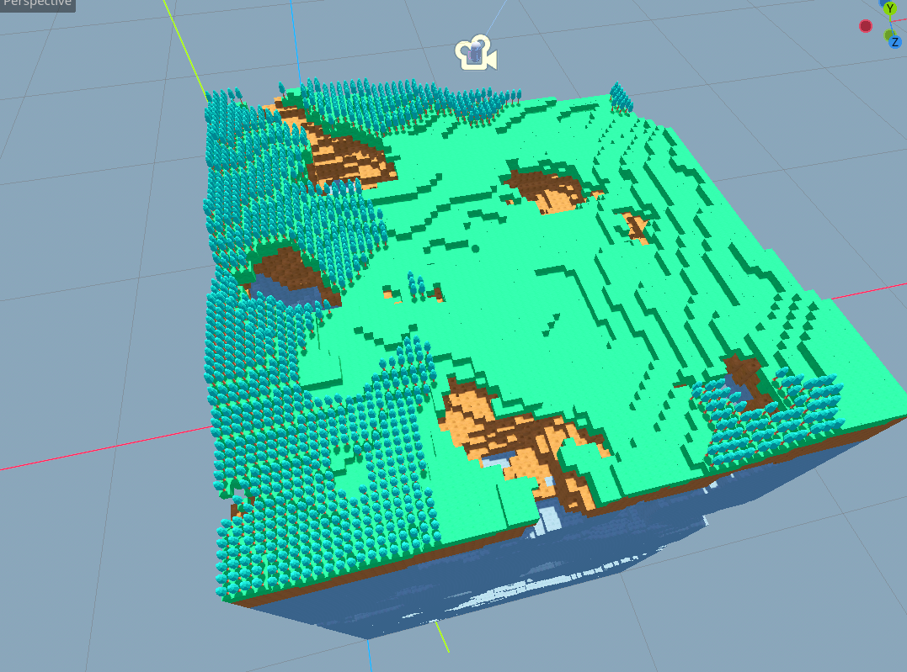

# Advanced Modifier

> This tutorial requires a fair bit of knowledge on how Gaea and modifiers work.

The good ol' modifiers not meeting your needs? Don't fret! `AdvancedModifier2D/3D` is a modular modifier which will supercharge your generation.

## Conditions

The main bulk of this modifier are conditions. It holds an ordered list of conditions that all have to be met for it to place the chosen `TileInfo` in the target cell. As of July 28 2024, there are 3 conditions you can use:

### ChanceCondition

Pretty self explanatory, it will only be met `chance`% of times.

### NoiseCondition

It will only be met where the noise value is between `min` and `max`.

### OffsetCondition

It will only be met if any tile at `offset` in any `layers` has an id listed in `ids`. 

> In this example, the condition is only met if any tiles at layer 0 below the cell it's trying to modify have an id of "ground".

## Uses

In this example, it's used to place vegetation on top of a `HeightmapGenerator2D`'s generation. 

In the setup, you can see it's checking for a ground tile below it and it will only place it 50% of the time. Then the `RandomTileInfo` chooses between grass, tall grass and a tree. _It's also worth noting that the modifier's `filter_type` is set to ONLY_EMPTY_CELLS, meaning it will only attempt this in "air" tiles._

In this other example, it's used to place torches in a dungeon.

And it also works in 3D!

## Adding your own condition

Simply extend `AdvancedModifierCondition` and replace the `is_condition_met` function with any logic you want.