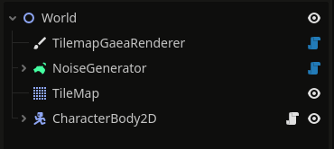
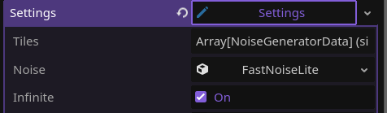

# How to enable Chunk Generation

> It is suggested you follow the [Getting Started](getting_started.md) tutorial **_BEFORE_** following this tutorial!

**SO**! You have a great big world to explore, but it takes forever to load ... This is where **Chunk Generation** comes in!

In this quick tutorial, you'll learn how to enable chunk generation to make it so your players can experience _vast_ worlds in a more optimized way!

## 2D Chunk Generation

> This tutorial assumes you have a basic understanding of how to set up `Generators` and `Renderers` within Gaea and as such will brush over these topics. 
> 
> If you don't have an understanding of these topics, see [this lovely tutorial](https://www.youtube.com/watch?v=oB1xsCcO9wI) by [DevWorm](https://www.youtube.com/@dev-worm)!

Gaea comes pre-packaged with multiple different generators, but for this example, we'll be using the `NoiseGenerator` node, the `TilemapGaeaRenderer` node, the Godot built-in `TileMap` node, and a `CharacterBody2D` node, which will represent our Player!

> Only certain generators work with chunk loading. These are the `ChunkAwareGenerator`s, such as the noise or heightmap generators. `ChunkAwareGenerator` is an abstract class that you can extend to make your own generators, but shouldn't be used on its own.

### Setup

Once you have all the pre-requisite nodes mentioned above setup in your scene, you will want to search for the `ChunkLoader2D` node.

After finding this node, you can add it anywhere in the scene tree, in this instance, I've added it as a child node of the `NoiseGenerator`

Once this node has been added to the tree, you need to assign the `Generator` and `Actor` nodes to the `ChunkLoader2D`, these map to the `NoiseGenerator` and `CharacterBody2D` nodes mentioned earlier!

It's also important that you set the settings `infinite` property to `true`!

After this has been done ... **_VOILÀ!_** You now have Chunk Generation enabled for your 2D world! Once this is done, you can play around with the settings of the ChunkLoader to tune it to your liking!

### It's running really slowly...

Don't worry! Go to [Lightning Fast Generation](tutorials/optimization.md) for a quick tutorial on how to improve speeds.

## 3D Chunk Generation

Chunk loading in 3D works the same as in 2D. Nodes mentioned above have their own 3D variant, such as `ChunkLoader3D`. Tips for optimization can also be found in [Lightning Fast Generation](tutorials/optimization.md). In 3D, these are especially important as it requires more power.