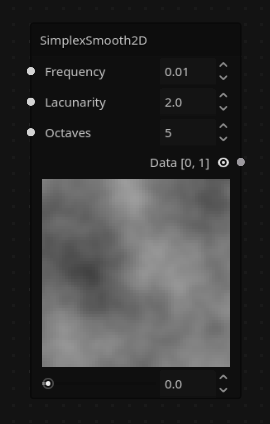
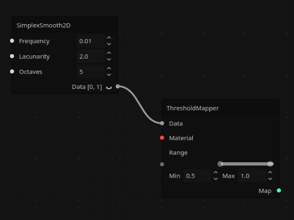
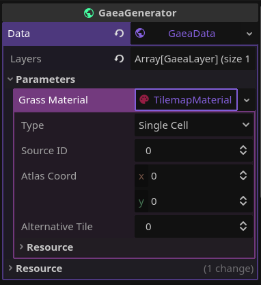
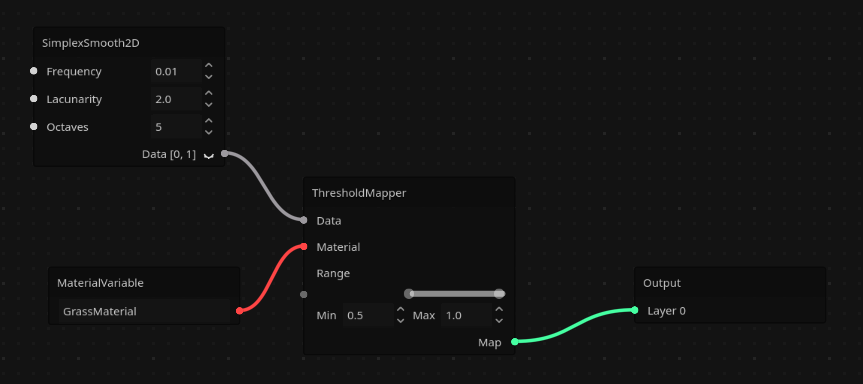
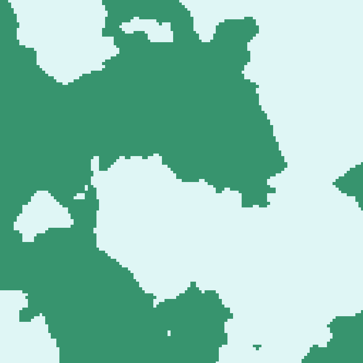
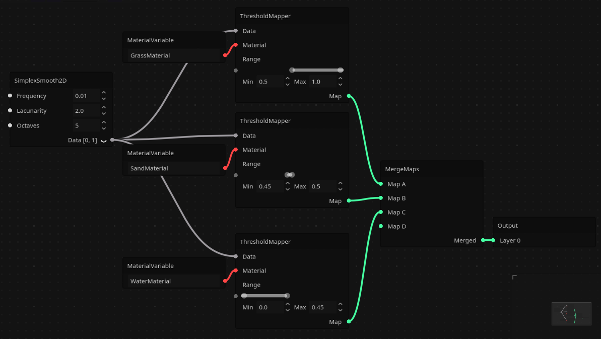
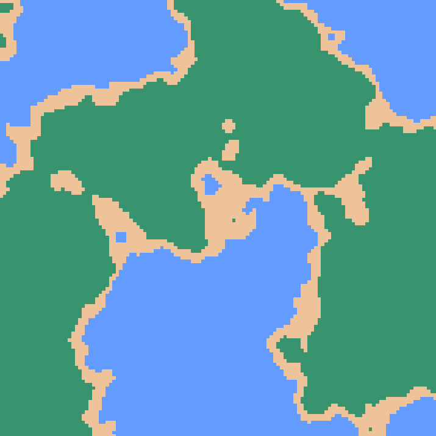

# Generating Terrain

In this tutorial we'll create a very simple terrain. This isn't the only way to generate terrain, but it'll get you in the right direction:

# Adding your Generator Node

As explained in [How Gaea Works](../how-gaea-works.md), add your `GaeaGenerator` node and create a `GaeaData` resource.

# Generating the Noise Data

Terrain is usually created with [noise](https://en.wikipedia.org/wiki/Perlin_noise), a black and white texture. Right click, and in the nodes list, under _Data/Basic/Noise_, you'll find the `SimplexSmooth2D` node. Double click to add it. This node will be the base of our generation. Click the closed eye icon next to the data output to see the preview:

If you've never experimented with procedural generation, that may not look like much, but it's the base of the terrain from games like Minecraft or Terraria, and many others.

# Mapping it to Tiles

Now add a `ThresholdMapper` node. _(Tip: you can search for nodes in the popup)_

This will allow to map certain values in the noise texture to `GaeaMaterial`s (tiles in `TileMapRenderer`s, elements in `GridMapRenderer`s, etc.). Move around the handles in the range parameter to whatever you want. In my case, I'll do `0.5`-`1.0`. Noise textures go from 0-1, 0 being completely black and 1 being completely white.

Connect the Data output from the noise node to the mapper.

Now, we need a material. Create a `MaterialVariable` node.

# Variables

In the inspector, click on the `GaeaData` resource. If you've added the variable node, you'll see a parameters dropdown. Open it and you'll see your new variable!

In the node, you can change the name of your variable to whatever you want. Let's say, GrassMaterial. It'll automatically update in the inspector. Now set that variable to a `GaeaMaterial` resource. For this example, we'll use a `TilemapMaterial`.

This resource tells the renderer what to draw. For `TilemapMaterial`s, you'll need to use a `GaeaTilemapRenderer` and a `TileMapLayer`. You can read more about `TileMapLayer`s from their documentation. You have to set up your TileSet.

Create those 2 nodes and assign the generator to the renderer, and the tile map layer to the first element in the renderer's `tile_map_layers` array. You can set those aside for now.

Now, connect the `MaterialVariable` node to the `Material` input in the mapper. Finally, connect the mapper's `Map` output to the `Layer 0` input in the `Output` node.

That's it! Click the generate button in the top right of the panel and see the magic happen! It should look a bit like this:

# Adding More Terrain Types

You can add more terrain types by adding more mapper nodes, and merging their outputs with the `MergeMaps` node. For example, this...

...generates this:

As you can see, nodes can output to multiple other nodes at the same time. (Like how the `SimplexSmooth2D` node connects to multiple `ThresholdMapper` nodes).

You can keep adding to this! You could even add decorations with layers, without having to make new tiles for each decoration and terrain type! Mess around with it as you'd like.