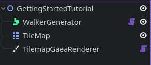
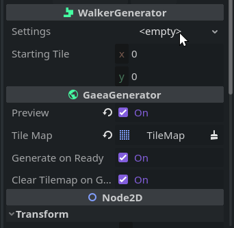
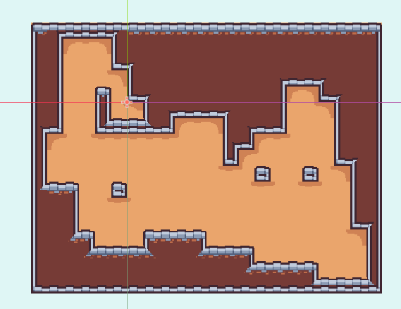
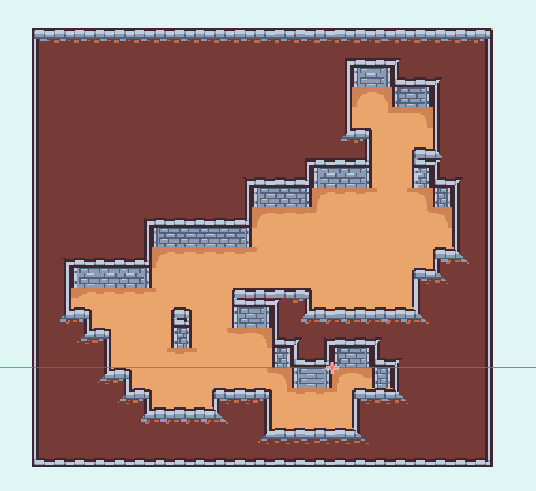

# Getting Started

> Before this tutorial, make sure Gaea is enabled in the project settings as explained in [What's Gaea?](/README.md)

**Thanks for trying out Gaea!** We're excited to have you play with it.

With Gaea's power, you can procedurally generate different worlds so you can add variety to your game, while also saving time on level design. Whether you're making a **roguelike** or a **sandbox**, Gaea has what you need!

In this tutorial, you'll learn how to make basic generation of a dungeon. 

## Generating the floor

Gaea comes with a bunch of different **generator nodes**. To make a dungeon, we'll use the [WalkerGenerator](/generators/walker.md), inspired by the algorithm used in Nuclear Throne.

> You can use the scene at `res://scenes/tutorials/getting_started/getting_started.tscn` to follow this tutorial. It starts with a WalkerGenerator and a TileMap node:\
> 

### GeneratorSettings

First, let's set up the generator's settings. Go to the generator's inspector, and add a `WalkerGeneratorSettings` resource to its `settings` property.\

#### What is this resource?
Every generator has its own `GeneratorSettings` resource, which is where all the **parameters** for the generation will be stored in. This allows for having different generations without having to even change scenes, just replacing the `settings` resource will do!

### Setting up the generation
Add a new `TileInfo` resource to the settings' `tile` property. This will tell the generator which tile to place by default.\
Set its type to `Terrain` and the `terrain` property to `3`.

Now, press **Generate**!\
See what happened? The floor of the dungeon was generated! It should look something like this:\
\
Change some of the values such as `fullness_check`, `max_tiles`/`fullness_percentage`, and the values under the `Walkers` category to see how the generation changes!

If you're finished playing around, you can move on to the next step!

## Walls and ceiling

A core part of Gaea are its **modifiers**. Used to make changes to your generation, they can be really useful to improve the look and/or functionality of the default generators. You can read more about them in [Modifiers](/modifiers.md)

In our case, we'll use 2 modifiers: **Fill** and **Walls**.

### The Fill modifier

Navigate to the `modifiers` property in the generator's settings resource and add a new element. Then, set that element to a new `Fill` modifier.

This modifier fills the empty areas in the generator's rectangle with the `TileInfo` you give it. Set its `tile` property to a new `TileInfo`, and its type to `Terrain` and the `terrain` property to `1`.

Now press **Generate** again! See how it generates a ceiling around the floor?\

You can change its `Expand` values to add more ceiling around the generation.

### Walls

Now, add a new modifier, and set it to a new `Walls` modifier. Again, set it's `wall_tile` property to a new `TileInfo` of type `Terrain` and `terrain` of `2`.

Click **Generate**, and see how it generates walls below the ceiling tiles!\

## And that's it!

Now you have a very cool looking dungeon for your roguelikes or zelda-likes, in just a few minutes! Remember to play around with the settings to check out the different generations you can get.