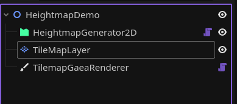
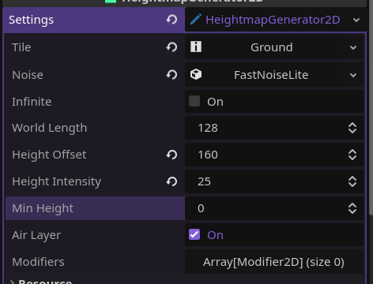
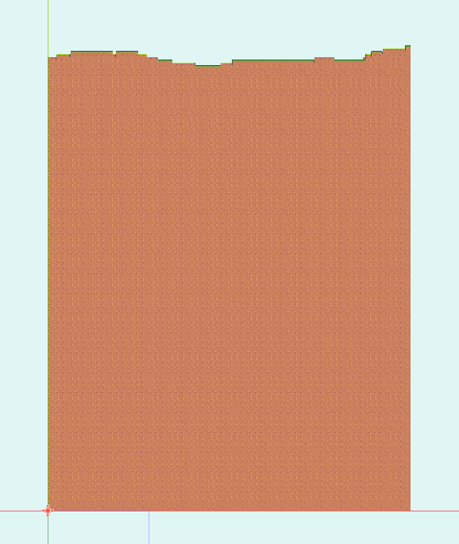
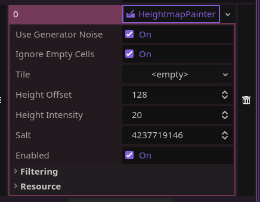
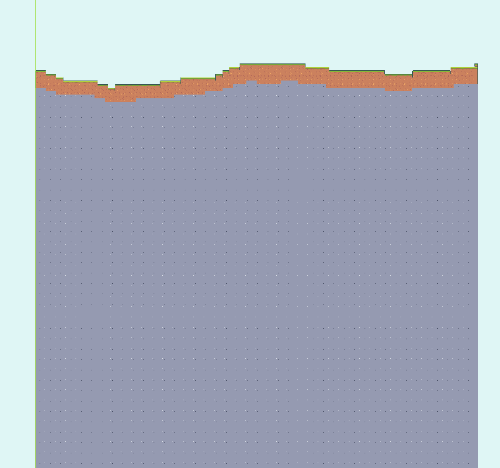
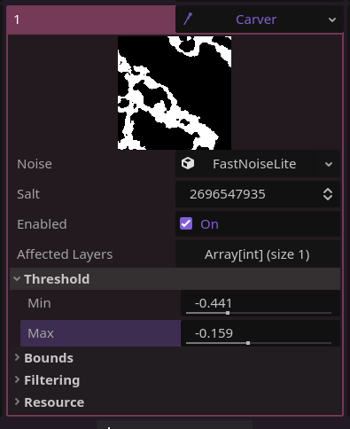
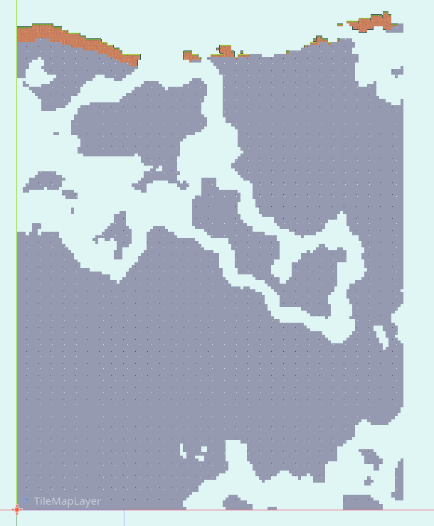
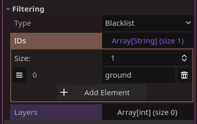
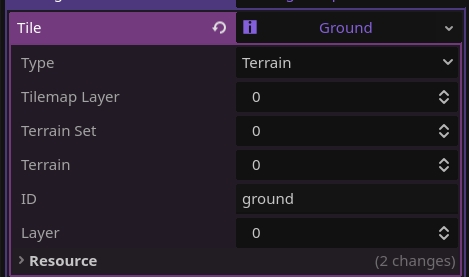
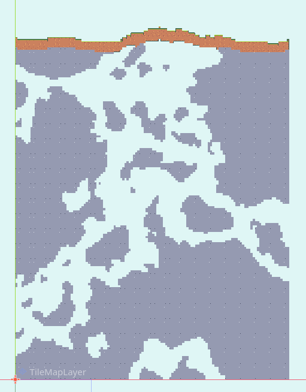

# Side-view terrain with HeightmapGenerator2D/3D

The HeightmapGenerator2D is a bit more complicated than the WalkerGenerator. You'll need to use some different modifiers to recreate the terrain of games like Terraria. Here's how:

## The nodes

The setup is similar to the one at [Getting Started](../tutorials/getting_started.md)

Assign each node's required nodes.

## The settings

Add a settings resource. Start by setting `tile` to a `TilemapTileInfo` (or whatever you'd like to use). Then, set `noise` to a `FastNoiseLite` resource. I recommend setting `noise_type` to **Perlin**.

After that, you can modify the terrain with the following properties:

- `world_length`: pretty self-explanatory, changes the width of your world.
- `height_offset`: it's the "medium" height of your terrain.
- `height_intensity`: at each column, the terrain's height is set to `height_offset` plus a random value between -`height_intensity` and `height_intensity`. So for example, in the next image's configuration, the minimum height a terrain can reach is 135 and the max is 185.
- `min_height`: by default, the terrain will start at y=0. You can change that with this property.

Click generate, and it should look something like this:

This is just the base though. Let's add more tiles:

## Modifiers

Add a new modifier to the `modifiers` list. It's going to be a `HeightmapPainter`:

What this one does is paint over the base using the same way of generating terrain. Let's set it's `height_offset` to something slightly below the generator's `height_offset`, and it's `height_intensity` to the same. Now, set `tile` to, for example, a stone tile. Click generate again.

Look at how the stone generates following the terrain's shape! You can use this method to add different terrain layers. But the terrain's looking kind of boring underground. Let's add some caves:

To add caves, use the `Carver` modifier to, well, carve the terrain! Set it's threshold values until the preview resembles caves (I recommend using the **Simplex** `noise_type` for this one)

**_VOILÀ!_**. The world is full of caves now. Maybe you don't want the `Carver` to remove dirt tiles though, so set it's filtering properties to something like this:

"ground" in the `IDs` list should be the id of the TileInfo you don't want it to remove:

`layers` can be left empty. This means it'll check on every layer for the filtering options.

Since `type` is set to **Blacklist**, it will NOT apply this modifier in any tiles of ID "ground" (or whatever you set). See?

You can use filters for all kind of things like this. For example, we can add a `NoisePainter` modifier and set it to only apply to stone tiles, and then use it to place ores around. 

## And it's done!

You have very basic, but easy to expand, terrain generation. 3D works basically the same (though you can use a `GridMap` instead), so give it a try! `HeightmapGenerator`s also work with chunk generation, so check out the [chunk generation tutorial](chunk_generation.md).